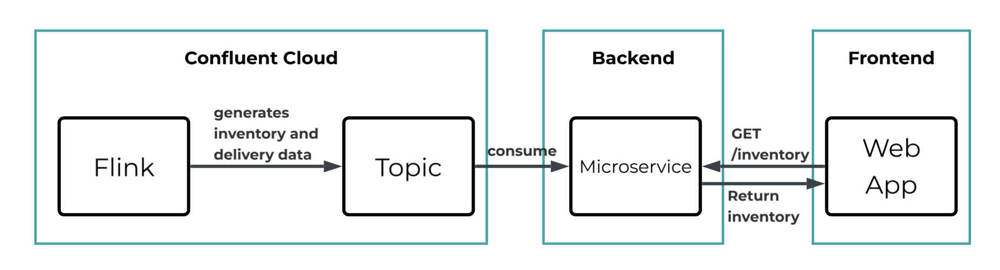

# Realtime inventory monitoring dashboard using Flink + Confluent Cloud.


# Architecture



# How to Run

# Confluent Cloud

1. Go into confluent-cloud folder
1. Update variables.tf
1. setup terraform

```sh
terraform init
```

4. run terraform

```sh
#!/bin/bash

set -xe

export CONFLUENT_CLOUD_API_KEY=key
export CONFLUENT_CLOUD_API_SECRET=secret

terraform apply

Apply complete! Resources: 100 added, 0 changed, 0 destroyed.

Outputs:


bootstrap-server = "SASL_SSL://pkc-n98pk.us-west-2.aws.confluent.cloud:9092"
sr-endpoint = "https://psrc-nvgyv3.southeastasia.azure.confluent.cloud"
```

5. Copy Kafka API Key

```sh
jq -r --arg name "app-manager-kafka-api-key" '
  .resources[]
  | select(.type == "confluent_api_key" and .name == $name)
  | .instances[0].attributes
  | {api_key: .id, api_secret: .secret}
' terraform.tfstate

{
  "api_key": "ABCD***",
  "api_secret": "cfltABCE***"
}
```

6. Copy Schema Registry API Key

```sh
jq -r --arg name "schema-registry-api-key" '  
  .resources[]
  | select(.type == "confluent_api_key" and .name == $name)
  | .instances[0].attributes
  | {api_key: .id, api_secret: .secret}
' terraform.tfstate

{
  "api_key": "RAK***",
  "api_secret": "cflt0PX***"
}
```

# Backend

We're creating a REST API endpoint using [microservice-for-kafka](https://github.com/tsuz/microservice-for-kafka) which consumes from a topic and exposes them as a REST API endpoint.

You can run this locally or on a remote instance as long as you have Docker and docker compose.

1. Go into `microservice` folder
2. Create a config.yaml from config.example.yaml and replace `<bootstrap-server>`, `<kafka-cluster-api-key>`, `<kafka-cluster-api-secret>`, `<sr-api-key>`, `<sr-api-secret>` from the steps above from Confluent Cloud Terraform.

```sh
kafka:    
  application.id: my-inventory-demo

  # Bootstrap Server
  bootstrap.servers: <bootstrap-server>:9092
  security.protocol: SASL_SSL
  sasl.jaas.config: "org.apache.kafka.common.security.plain.PlainLoginModule required username='<kafka-cluster-api-key>' password='<kafka-cluster-api-secret>';"
  sasl.mechanism: PLAIN

  # Schema Registry
  schema.registry.url: https://<sr-endpoint>
  basic.auth.credentials.source: USER_INFO
  basic.auth.user.info: "<sr-api-key>:<sr-api-secret>"
  orders_5min_realtime
  metrics.recording.level: DEBUG
  fetch.min.bytes: 10048576
  fetch.max.wait.ms: 1500
  max.partition.fetch.bytes: 10048576
  receive.buffer.bytes: 10048576
  num.stream.threads: 6

  state.dir: ./data
      
paths:  
  /inventory:
    get:  
      description: Return all inventories
      kafka:  
        topic: inventory_20260119_1902_test
        query:
          method: all
        serializer:
          key: avro
          value: avro
        mergeKey: true
        keyField: productId
      responses:
        '200':
          description: A list of inventories
          content:
            application/json:
              schema:
                type: array

  /inventory/{productId}:
    parameters:
    - name: productId
      in: path
      description: the product identifier
    get:
      kafka:
        topic: inventory_20260119_1902_test
        serializer:
          key: avro
          value: avro
        query:
          method: get
          key: ${parameters.productId}
        mergeKey: true
        keyField: productId
      responses:
        '200':
          description:
          content:
            application/json:
              schema:
                type: object


  /aggregation/5min/{productId}/{windowStart}:
    parameters:
    - name: productId
      in: path
      description: the product id
    - name: windowStart
      in: path
      description: the start window of product purchase
    get:
      kafka:
        topic: orders_5min_realtime
        serializer:
          key: avro
          value: avro
        keyFields:
          product_id: ${parameters.productId}
          bucket_start: ${parameters.windowStart}
        mergeKey: true  # Include key fields in response
        query:
          method: get
          key: ${parameters.productId}
      responses:
        '200':
          description:
          content:
            application/json:
              schema:
                type: object
```

3. Run `docker compose up -d`
4. Once the topic messages are restored, the endpoint 7001 will be available.

```sh
curl localhost:7001/inventory

[{"productId":1,"nameJa":"プレミアムコーヒー","nameEn":"Premium Coffee","category":"Beverages","shownInStore":0,"updatedAt":1769621073235,"inventoryQty":46,"deliveryQty":0,"salesPerHour":20},{"productId":2,"nameJa":"おにぎり（鮭）","nameEn":"Onigiri (Tuna)","category":"Food","shownInStore":0,"updatedAt":1769621073135,"inventoryQty":21,"deliveryQty":0,"salesPerHour":20},{"productId":3,"nameJa":"職人チョコレート","nameEn":"Artisan Chocolate","category":"Confectionery","shownInStore":0,"updatedAt":1769621073235,"inventoryQty":126,"deliveryQty":0,"salesPerHour":3},{"productId":4,"nameJa":"カツサンド","nameEn":"Katsu Sando","category":"Food","shownInStore":0,"updatedAt":1769621073235,"inventoryQty":6,"deliveryQty":15,"salesPerHour":7},{"productId":5,"nameJa":"フルーツボウル","nameEn":"Fruits Bowl","category":"Food","shownInStore":0,"updatedAt":1769621073235,"inventoryQty":6,"deliveryQty":0,"salesPerHour":3},{"productId":6,"nameJa":"たまごサンド","nameEn":"Egg Sandwich","category":"Food","shownInStore":0,"updatedAt":1769621073135,"inventoryQty":6,"deliveryQty":18,"salesPerHour":9},{"productId":7,"nameJa":"チキンサラダ","nameEn":"Chicken Salad","category":"Food","shownInStore":0,"updatedAt":1769621073235,"inventoryQty":6,"deliveryQty":15,"salesPerHour":10},{"productId":8,"nameJa":"缶コーヒー","nameEn":"Canned Coffee","category":"Beverages","shownInStore":0,"updatedAt":1769621073235,"inventoryQty":26,"deliveryQty":140,"salesPerHour":15},{"productId":9,"nameJa":"緑茶","nameEn":"Green Tea","category":"Beverages","shownInStore":0,"updatedAt":1769621073235,"inventoryQty":26,"deliveryQty":85,"salesPerHour":10},{"productId":10,"nameJa":"ビール","nameEn":"Beer","category":"Beverages","shownInStore":0,"updatedAt":1769621073235,"inventoryQty":26,"deliveryQty":85,"salesPerHour":5}]
````


# Frontend

There are two ways to run the front end: either locally or run using docker.

1. go into `frontend` folder
1. You must update the API endpoint created in Backend in `src/lib/api.ts`

```js
const INVENTORY_API_URL = 'http://52.68.213.179:7001/inventory';
const AGGREGATION_API_URL = 'http://52.68.213.179:7001/aggregation/5min';
```

3. Then to run it locally, run `npm run dev` which should show the values being updated.
4. To run it on docker, run `docker compose up -d` 
5. Open your browser to `<host>:3000`
